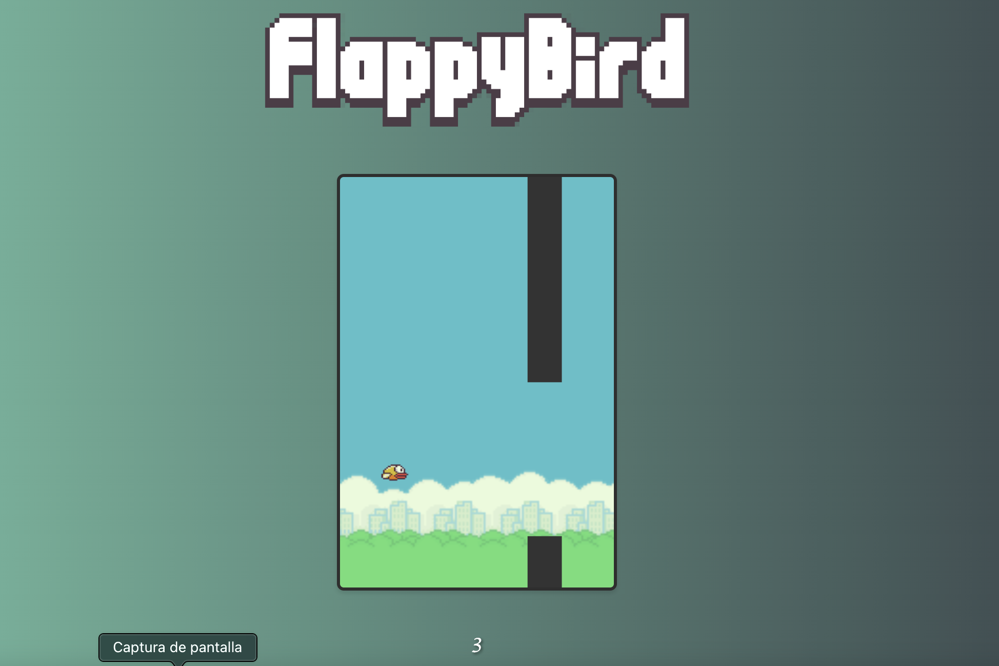

# 🎮 Flappy Bird (HTML5)  

  


Clon del clásico juego *Flappy Bird* desarrollado con **HTML5, CSS3 y JavaScript vanilla**.  

## 🕹️ Controles  
- **↑ (Flecha arriba)**: Saltar  
- **Click/Tap**: Saltar (para móviles)  

## ✨ Características  
- **Diseño responsive**: Funciona en móvil y desktop  
- **Efectos de sonido**: Al saltar y chocar  
- **Animaciones fluidas**: CSS + JavaScript  
- **High Score**: Guarda tu récord localmente  

## 🚀 Cómo jugar  
1. Abre `index.html` en tu navegador.  
2. Presiona **↑ (flecha arriba)** para volar.  
3. Pasa entre los tubos verdes para sumar puntos.  

```bash
# Opcional: Si usas Live Server (VS Code)
npm install -g live-server
live-server
